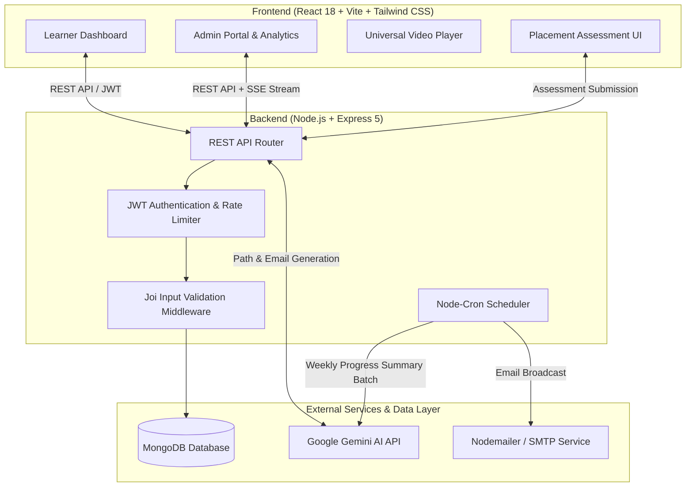

# 🎓 NaviLearn – AI-Powered Adaptive Learning Management System (LMS)

[](https://opensource.org/licenses/ISC)
[](https://react.dev/)
[](https://nodejs.org/)
[](https://www.mongodb.com/)
[](https://ai.google.dev/)

**NaviLearn** is an end-to-end adaptive Learning Management System designed to personalize student learning paths. Utilizing diagnostic placement assessments and Google Gemini AI, NaviLearn evaluates student mastery per skill tag and automatically builds a customized learning timeline—fast-tracking mastered skills with clear AI explanations while focusing the learner on their exact skill gaps.

---

## 📐 System Architecture



---

## ✨ Key Features

### 👤 Learner Features
- **Diagnostic Placement Assessment**: Quick multi-question skill assessment upon course enrollment.
- **AI-Personalized Timeline**: Dynamically generated study path skipping mastered skills with explicit reason callouts (e.g., *"Skipped: 100% mastery in Arrays during onboarding"*).
- **Fast-Tracked Skills Sidebar**: Mastered modules are accessible optionally at any time without blocking timeline progress.
- **Universal Video Player**: Seamlessly streams YouTube (watch/embed/shorts), Vimeo, Google Drive, and direct HTML5 `.mp4` video files.
- **Real-Time Progress Tracking**: Dynamic course completion indicators and interactive module players.

### 🛡️ Admin Features
- **Widescreen Curriculum Builder**: Two-column layout separating Course Modules and Placement Quiz questions to eliminate vertical scrolling.
- **Split-Screen Learner Analytics**:
  - **Enrolled Students Table**: Capped scrollable table with search filter and pagination (10 learners/page).
  - **Module Drop-off Heatmap**: Dynamic visual heat map showing exact drop-off rates per module.
- **Learner Health Indicators**: Automated health composite scores (`Healthy`, `At-Risk`, `Struggling`) based on activity and assessment performance.
- **CSV Data Export**: One-click export of learner analytics reports.

### ⚡ Infrastructure & Safety
- **Token-Aware Rate Limiting**: Automatic backoff with jitter for Google Gemini API calls to prevent 429 rate limit exceptions.
- **Joi Request Validation**: Strict schema validation for registration, login, and assessment payloads.
- **Cron Progress Automation**: Weekly automated progress emails powered by Gemini AI batch generation.

---

## 🛠️ Technology Stack

- **Frontend**: React 18, Vite, React Router v6, TanStack React Query v5, Tailwind CSS, Lucide Icons
- **Backend**: Node.js, Express 5, Mongoose ODM, JWT (Access + Refresh token rotation), bcryptjs, Joi, express-rate-limit
- **AI Integration**: Google Generative AI (`@google/generative-ai` - Gemini Flash)
- **Database**: MongoDB / MongoDB Atlas
- **Email Service**: Nodemailer (SMTP / Gmail App Passwords)

---

## 📁 Project Structure

```
LMS/
├── client/                     # React Vite Frontend
│   ├── src/
│   │   ├── components/         # Reusable UI components
│   │   ├── context/            # Authentication Context
│   │   ├── pages/              # Dashboard, Catalog, Admin Views
│   │   ├── utils/              # API fetch helper with token refresh
│   │   └── config.js           # Centralized environment config
│   ├── .env.development        # Client dev environment variables
│   ├── .env.production         # Client production environment variables
│   └── vercel.json             # Vercel SPA routing configuration
│
├── server/                     # Node.js Express Backend
│   ├── middleware/             # Auth, Joi Validation, Rate Limiter
│   ├── models/                 # Mongoose Schemas (User, Course, Progress, etc.)
│   ├── routes/                 # Auth, Courses, Learner API endpoints
│   ├── services/               # Gemini AI, Email, and Cron Scheduler
│   ├── scripts/                # Database seed scripts
│   └── .env.example            # Backend environment variables template
│
├── render.yaml                 # Infrastructure-as-code for Render/Railway
└── README.md                   # System Documentation
```

---

## ⚙️ Environment Variables

### Backend (`server/.env`)
Create a `.env` file in the `server/` directory (refer to `server/.env.example`):

```env
PORT=5000
MONGO_URI=mongodb://localhost:27017/lms
JWT_SECRET=your_access_token_secret_key
JWT_REFRESH_SECRET=your_refresh_token_secret_key
GEMINI_API_KEY=your_google_gemini_api_key

# Admin Setup
ADMIN_NAME="System Administrator"
ADMIN_EMAIL=admin@example.com
ADMIN_PASSWORD=AdminSecurePassword123!

# Email (SMTP) Configuration
SMTP_HOST=smtp.gmail.com
SMTP_PORT=587
SMTP_SECURE=false
SMTP_USER=your_email@gmail.com
SMTP_PASS=your_app_password

# Cron Schedule (Default: Mondays at 9:00 AM)
CRON_SCHEDULE=0 9 * * 1
```

### Frontend (`client/.env.development` & `client/.env.production`)

```env
VITE_API_URL=http://localhost:5000
```

---

## 🚀 Local Development Setup

### Prerequisites
- **Node.js** (v18+ or v20+)
- **MongoDB** running locally or a MongoDB Atlas connection string

### 1. Clone the repository
```bash
git clone https://github.com/your-username/LMS.git
cd LMS
```

### 2. Set up Backend
```bash
cd server
npm install
cp .env.example .env
# Edit .env with your MongoDB URI and Gemini API key
npm run dev
```

### 3. Set up Frontend
```bash
cd ../client
npm install
npm run dev
```

### 4. Seed Initial Data (Optional)
To populate sample courses and test users:
```bash
cd server
node scripts/seedCourse.js
```

Open `http://localhost:5173` in your browser.

---

## 🌐 Production Deployment

### Frontend (Vercel)
1. Push code to GitHub repository.
2. Import project in [Vercel](https://vercel.com).
3. Set **Root Directory** to `client`.
4. Add Environment Variable:
   - `VITE_API_URL`: `https://your-backend-api.onrender.com`
5. Deploy. (`client/vercel.json` automatically handles client-side routing).

### Backend (Render / Railway)
1. Create a new Web Service on [Render](https://render.com) or [Railway](https://railway.app).
2. Connect your GitHub repository (using `render.yaml` or manual configuration).
3. Set **Root Directory** to `server`.
4. **Build Command**: `npm install`
5. **Start Command**: `node index.js`
6. Configure environment variables (`MONGO_URI`, `GEMINI_API_KEY`, `JWT_SECRET`, `SMTP_*`).
7. Deploy.

---

## 📝 License
This project is licensed under the [ISC License](LICENSE).
