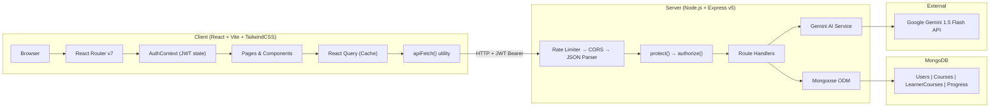
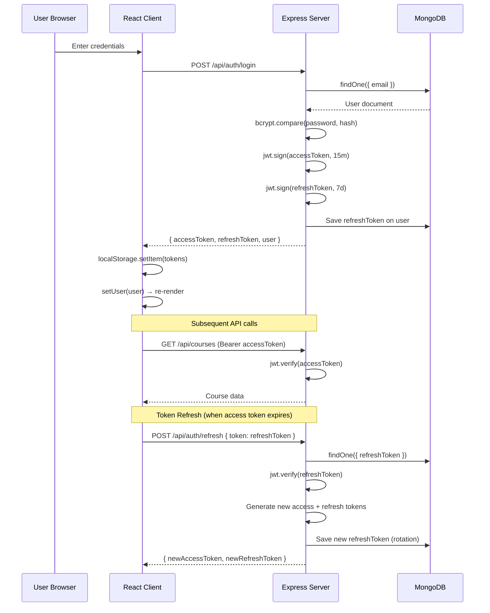

# NaviLearn LMS — Complete End-to-End Code Flow Walkthrough

> **Purpose**: This document provides a **line-by-line code flow explanation** for every user scenario implemented in the NaviLearn project, sequenced in the order a real user would encounter them. It is written to serve as a **Google interview presentation guide** — each scenario tells a coherent story with the technical depth expected at that level.

---

## Table of Contents

1. [Architectural Overview](#1-architectural-overview)
2. [Scenario 1 — Server Bootstrap & Database Connection](#scenario-1)
3. [Scenario 2 — Admin User Seeding (First Admin Registration)](#scenario-2)
4. [Scenario 3 — Admin Login](#scenario-3)
5. [Scenario 4 — Admin Creates a Course](#scenario-4)
6. [Scenario 5 — Admin Adds Modules to a Course](#scenario-5)
7. [Scenario 6 — Admin Adds Assessment Questions](#scenario-6)
8. [Scenario 7 — Learner Registration](#scenario-7)
9. [Scenario 8 — Learner Enrolls in a Course](#scenario-8)
10. [Scenario 9 — Learner Completes Onboarding Assessment & AI Path Generation](#scenario-9)
11. [Scenario 10 — Learner Views Dashboard, Studies Modules & Marks Complete](#scenario-10)
12. [Cross-Cutting Concerns](#cross-cutting-concerns)
13. [Engineering Challenges & Google Interview Talking Points](#challenges)

---

## 1. Architectural Overview {#1-architectural-overview}



### Tech Stack Summary

| Layer | Technology | Version | Purpose |
|---|---|---|---|
| Frontend Framework | React | 19.2.6 | UI rendering |
| Build Tool | Vite | 5.4.11 | Dev server & bundler |
| Styling | TailwindCSS | 4.3.0 | Utility-first CSS |
| Server Cache | React Query | 5.101.0 | Server state management |
| Routing | React Router | 7.17.0 | Client-side routing |
| Icons | Lucide React | 1.17.0 | SVG icon library |
| Backend | Express.js | 5.2.1 | REST API server |
| ODM | Mongoose | 8.24.0 | MongoDB object modeling |
| Auth | jsonwebtoken + bcryptjs | 9.0.3 / 3.0.3 | JWT auth + password hashing |
| Validation | Joi | 18.2.1 | Request body validation |
| Rate Limiting | express-rate-limit | 8.5.2 | Brute-force protection |
| AI | @google/generative-ai | 0.24.1 | Gemini SDK |
| Dev | nodemon + concurrently | 3.1.14 / 9.2.1 | Hot reload + parallel dev |

---

<a id="scenario-1"></a>
## Scenario 1 — Server Bootstrap & Database Connection

### What Happens

When `npm run dev` is executed from the monorepo root, `concurrently` (defined in the root [package.json](file:///c:/Users/hiksm/Projects/LMS/package.json)) starts both the server (`nodemon index.js`) and the client (`vite`) in parallel.

### Server Code Flow — [index.js](file:///c:/Users/hiksm/Projects/LMS/server/index.js)

```
Line  1-4:  Import dependencies: express, mongoose, cors, dotenv.
            dotenv.config() loads the .env file, making MONGO_URI, JWT_SECRET,
            JWT_REFRESH_SECRET, GEMINI_API_KEY available via process.env.

Line  6-8:  Import route modules: auth, courses, learner.
            Each is a separate Express Router.

Line  9:    Import express-rate-limit for brute-force protection.

Line 11:    Create the Express application instance.
Line 12:    PORT defaults to 5000 if not set in .env.

Line 14-21: RATE LIMITER CONFIGURATION for auth routes:
            - windowMs: 15 * 60 * 1000 = 15 minutes
            - max: 20 = max 20 requests per IP per window
            - message: Custom JSON error returned on limit breach
            - standardHeaders: true = sets RateLimit-* headers (RFC 6585)
            - legacyHeaders: false = disables X-RateLimit-* legacy headers

Line 23-25: MIDDLEWARE PIPELINE (order matters!):
            1. cors() — Allows cross-origin requests (client on port 5173,
               server on port 5000). Without this, browser blocks requests.
            2. express.json() — Parses incoming JSON request bodies, populating
               req.body. Must come BEFORE route handlers.

Line 27-30: ROUTE MOUNTING:
            - '/api/auth' → authLimiter middleware → auth routes
              (register, login, refresh, logout, create-admin)
            - '/api/courses' → course routes (CRUD + modules + assessment)
            - '/api/learner' → learner routes (enroll, assessment, path, progress)

Line 38-40: Health check endpoint — GET /api/health
            Returns { status: 'ok', message: 'LMS Backend is running' }
            Used by deployment platforms (Render/Vercel) to verify uptime.

Line 42-52: DATABASE CONNECTION & SERVER START:
            mongoose.connect(process.env.MONGO_URI)
            - Returns a Promise. On success:
              - Logs 'MongoDB connected successfully'
              - Calls app.listen(PORT) to bind the HTTP server
              - Logs 'Server is running on port 5000'
            - On failure:
              - Logs the error (e.g., wrong URI, network unreachable)
              - Server does NOT start — fail-fast design
```

> [!IMPORTANT]
> **Design Decision**: The server binds to the port **only after** a successful database connection. This is a fail-fast pattern: if MongoDB is down, the server doesn't start accepting requests that would all fail with DB errors. This avoids silent failures and makes deployment health checks reliable.

### Client Code Flow — [main.jsx](file:///c:/Users/hiksm/Projects/LMS/client/src/main.jsx)

```
Line  1-4:  Import React StrictMode, createRoot, QueryClient, and DevTools.

Line 11-20: REACT QUERY CLIENT CONFIGURATION:
            - staleTime: 2 minutes — data is considered "fresh" for 2 mins
              after fetch. React Query won't re-fetch while data is fresh.
            - gcTime: 5 minutes — unused cache entries are garbage-collected
              after 5 minutes of zero active observers.
            - retry: 1 — failed queries retry once before surfacing error.
            - refetchOnWindowFocus: true — when user tabs back to the app,
              stale queries automatically re-fetch (ensures fresh data).

Line 22-29: RENDER TREE:
            StrictMode → QueryClientProvider → App → DevTools
            - StrictMode: Double-invokes effects in dev for bug detection
            - QueryClientProvider: Makes the QueryClient available to all
              child components via React Context
            - DevTools: Floating panel showing cache state (dev only)
```

---

<a id="scenario-2"></a>
## Scenario 2 — Admin User Seeding (First Admin Registration)

### Why This Exists

> [!NOTE]
> The registration flow always creates **Learner** accounts (hardcoded default). The very first Admin account has no API to create it (chicken-and-egg problem: `POST /api/auth/create-admin` requires an existing Admin token). So we use a seed script run from the command line.

### Server Code Flow — [seed.js](file:///c:/Users/hiksm/Projects/LMS/server/scripts/seed.js)

Executed via: `npm run seed` → `node scripts/seed.js`

```
Line  1-5:  Import mongoose, bcryptjs, User model.
            Load .env using path.resolve to ensure correct path resolution
            regardless of working directory (scripts/ vs server/).

Line  7:    Define async seedAdmin() function.

Line 10:    Connect to MongoDB using MONGO_URI from .env.

Line 14:    IDEMPOTENCY CHECK:
            User.findOne({ email: process.env.ADMIN_EMAIL })
            - If admin already exists → skip creation (line 32).
            - This makes the script safe to run multiple times.

Line 18-19: PASSWORD HASHING:
            bcrypt.genSalt(10) — generates a salt with 10 rounds (2^10 = 1024
            iterations). This is the industry-standard cost factor balancing
            security vs. performance.
            bcrypt.hash(password, salt) — produces a 60-character hash string
            containing: algorithm identifier + salt + hash.

Line 22-27: CREATE ADMIN DOCUMENT:
            new User({ name, email, password: hashedPassword, role: 'Admin' })
            - The role is explicitly set to 'Admin' (overriding the default 'Learner').
            - The raw password is NEVER stored — only the bcrypt hash.

Line 29:    user.save() — Mongoose validates the document against the schema
            and issues a db.users.insertOne() command to MongoDB.

Line 36-38: CLEANUP: Disconnect from database and exit process with code 0.
            process.exit(0) — clean exit. process.exit(1) on error.
```

### User Model Schema — [User.js](file:///c:/Users/hiksm/Projects/LMS/server/models/User.js)

```
Line  3-35: Schema definition:
            - name: String, required, trimmed
            - email: String, required, unique index, lowercase transform
              (ensures 'John@Gmail.com' and 'john@gmail.com' match)
            - password: String, required (stores bcrypt hash, never plaintext)
            - role: String, enum ['Admin', 'Learner'], default 'Learner'
            - refreshToken: String, default null (populated on login)
            - lastActive: Date, default Date.now (updated on login)
            - timestamps: true → Mongoose auto-generates createdAt, updatedAt
```

> [!TIP]
> **Interview point**: The `unique: true` on email creates a MongoDB unique index. This is an **application-level AND database-level constraint** — even if two concurrent requests bypass the `findOne` check, the second `save()` will throw a duplicate key error (E11000), guaranteeing data integrity.

---

<a id="scenario-3"></a>
## Scenario 3 — Admin Login

### Client-Side Code Flow

#### Step 1: User navigates to `/login`

**[App.jsx](file:///c:/Users/hiksm/Projects/LMS/client/src/App.jsx) — Routing**

```
Line 16:    <Router> wraps everything in BrowserRouter for client-side routing.
Line 17:    <AuthProvider> wraps all routes, making auth state globally available.
Line 23:    <Route path="/login" element={<Login />} /> — public route, no guard.
```

#### Step 2: Login form renders

**[Login.jsx](file:///c:/Users/hiksm/Projects/LMS/client/src/pages/Login.jsx)**

```
Line  6-12: Component setup:
            - useState for email, password, error, submitting
            - useAuth() hook to access login function from AuthContext
            - useNavigate() for programmatic redirect after login

Line 14-31: handleSubmit() — FORM SUBMISSION HANDLER:
            Line 15: e.preventDefault() — prevents browser's default form POST
            Line 16: setError('') — clear any previous error message
            Line 17: setSubmitting(true) — disable button, show 'Signing in...'

            Line 20: const loggedInUser = await login(email, password)
                      ↓ Calls AuthContext.login() which calls apiFetch()

            Line 21-24: ROLE-BASED REDIRECT:
                        if (loggedInUser.role === 'Admin') → navigate('/admin')
                        else → navigate('/dashboard')

            Line 26-28: CATCH block: Display server error message in red banner.
            Line 30:    FINALLY: setSubmitting(false) — re-enable button.

Line 33-107: JSX RENDER:
             - Centered card layout with indigo theme
             - Email input with Mail icon (Lucide)
             - Password input with Lock icon
             - Error banner (conditionally rendered)
             - Submit button with loading state text swap
             - Link to /register page
```

#### Step 3: AuthContext.login() calls API

**[AuthContext.jsx](file:///c:/Users/hiksm/Projects/LMS/client/src/context/AuthContext.jsx)**

```
Line 27-40: login = async (email, password) => {
            Line 28: apiFetch('/api/auth/login', {
                       method: 'POST',
                       body: JSON.stringify({ email, password }),
                       skipAuth: true,  ← No JWT needed for login
                     })

            Line 34-36: ON SUCCESS — Store tokens and user data:
                        localStorage.setItem('accessToken', data.accessToken)
                        localStorage.setItem('refreshToken', data.refreshToken)
                        localStorage.setItem('user', JSON.stringify(data.user))

            Line 38: setUser(data.user) — updates React state → triggers re-render
                     across all components consuming useAuth()

            Line 39: return data.user — Login.jsx reads .role for redirect
            }
```

#### Step 4: apiFetch() makes the HTTP request

**[api.js](file:///c:/Users/hiksm/Projects/LMS/client/src/utils/api.js)**

```
Line 52-54: Destructure custom `skipAuth` flag from options.
            Remaining options passed directly to native fetch.

Line 57:    Build headers object from any existing custom headers.

Line 60-65: JWT INJECTION:
            if (!skipAuth) → read 'accessToken' from localStorage
            → set headers['Authorization'] = 'Bearer <token>'
            For login, skipAuth=true so this is SKIPPED.

Line 68-70: AUTO CONTENT-TYPE:
            If body exists and no Content-Type is set →
            headers['Content-Type'] = 'application/json'

Line 74-85: EXECUTE REQUEST:
            fetch(`${config.API_URL}${path}`, { ...fetchOptions, headers })
            - config.API_URL is read from VITE_API_URL env variable
            - On network failure (server down): throws user-friendly
              'Unable to connect to the server' error.

Line 88-101: ERROR HANDLING:
             if (!response.ok):
             1. Try to parse JSON error body from server
             2. Extract .message or .error field
             3. Throw Error with: server message || STATUS_MESSAGES map || generic

Line 106-108: SUCCESS: Parse JSON response and return.
              Handles 204 No Content (returns null).
```

### Server-Side Code Flow

#### Step 5: Rate limiter checks the request

**[index.js](file:///c:/Users/hiksm/Projects/LMS/server/index.js)**

```
Line 28:    app.use('/api/auth', authLimiter, authRoutes)
            The authLimiter middleware executes BEFORE the route handler:
            - Checks IP address against sliding window counter
            - If > 20 requests in 15 minutes: returns 429 with JSON error
            - Otherwise: increments counter and calls next()
```

#### Step 6: Validation middleware validates request body

**[auth.js route](file:///c:/Users/hiksm/Projects/LMS/server/routes/auth.js)**

```
Line 70:    router.post('/login', validateBody(loginSchema), async (req, res) => {
```

**[validation.js](file:///c:/Users/hiksm/Projects/LMS/server/middleware/validation.js)**

```
Line  6-15: validateBody(schema) — HIGHER-ORDER MIDDLEWARE FACTORY:
            Returns a middleware function that:
            Line 8:  Runs schema.validate(req.body, { abortEarly: false })
                     abortEarly: false → collects ALL errors, not just first
            Line 9:  If validation fails:
                     Line 10: Map error.details to human-readable messages
                     Line 11: Return 400 with { errors: [...messages] }
            Line 13: If valid: call next() to proceed to route handler

Line 35-43: loginSchema — Joi validation rules:
            - email: must be valid email format, required
            - password: required (no min length check for login, unlike register)
            Custom error messages via .messages({...})
```

#### Step 7: Route handler authenticates the user

**[auth.js route](file:///c:/Users/hiksm/Projects/LMS/server/routes/auth.js)**

```
Line 70-109: POST /api/auth/login HANDLER:

Line 72:     Destructure { email, password } from validated req.body.

Line 75-78:  FIND USER:
             User.findOne({ email })
             - MongoDB query on the indexed 'email' field (O(log n))
             - If not found → 400 'Invalid credentials'
             - Note: SAME error for wrong email or wrong password
               (prevents user enumeration attack)

Line 81-84:  VERIFY PASSWORD:
             bcrypt.compare(password, user.password)
             - Extracts salt from stored hash, hashes input with same salt
             - Compares resulting hash with stored hash
             - Runs in ~100ms (intentionally slow to resist brute-force)
             - If no match → 400 'Invalid credentials'

Line 87-88:  GENERATE TOKENS:
             accessToken = jwt.sign({ id, role }, JWT_SECRET, { expiresIn: '15m' })
             refreshToken = jwt.sign({ id }, JWT_REFRESH_SECRET, { expiresIn: '7d' })
             - Access token: short-lived (15 min), contains role for authz
             - Refresh token: long-lived (7 days), used to get new access tokens

Line 91-93:  PERSIST REFRESH TOKEN:
             user.refreshToken = refreshToken
             user.lastActive = new Date()  ← Track last login
             await user.save()
             - Storing the refresh token in DB enables server-side revocation
             - On logout, we null this field to invalidate the token

Line 95-104: RETURN RESPONSE:
             { accessToken, refreshToken, user: { id, name, email, role } }
             - Password hash is NEVER included in the response
             - Client stores tokens in localStorage
```

#### Step 8: Back on client — role-based redirect

After receiving the response, Login.jsx checks `loggedInUser.role`:
- `'Admin'` → `navigate('/admin')` → loads `AdminCatalog` component
- `'Learner'` → `navigate('/dashboard')` → loads `Dashboard` component

#### Step 9: ProtectedRoute guard validates access

**[ProtectedRoute.jsx](file:///c:/Users/hiksm/Projects/LMS/client/src/components/ProtectedRoute.jsx)**

```
Line  5-6:  Reads { user, loading } from AuthContext.

Line  8-13: LOADING STATE: While AuthContext initializes (reads localStorage),
            show a spinner. Prevents flash of login page.

Line 16-17: NO USER: If no user in context → redirect to /login.

Line 20-26: ROLE MISMATCH GUARD:
            If user.role is not in allowedRoles array:
            - Admin trying to access Learner route → redirect to /admin
            - Learner trying to access Admin route → redirect to /dashboard
            This is a CLIENT-SIDE guard. The SERVER also validates roles
            via the authorize() middleware (defense in depth).

Line 28:    AUTHORIZED: Render the child component.
```

---

<a id="scenario-4"></a>
## Scenario 4 — Admin Creates a Course

### Client-Side Code Flow

#### Step 1: AdminCatalog page loads and fetches courses

**[AdminCatalog.jsx](file:///c:/Users/hiksm/Projects/LMS/client/src/pages/AdminCatalog.jsx)**

```
Line  8-11: Component setup:
            - useAuth() → get user (for welcome message)
            - useNavigate() → for navigating to course detail page
            - useQueryClient() → for cache invalidation after mutations

Line 14-15: LOCAL STATE for form: newTitle, newDescription
            Only 2 fields → useState is appropriate (vs. useReducer for 6+ fields)

Line 18-25: QUERY: FETCH ALL COURSES
            useQuery({
              queryKey: ['adminCourses'],
              queryFn: () => apiFetch('/api/courses'),
            })
            - queryKey: ['adminCourses'] — unique cache identifier
            - queryFn: calls GET /api/courses with JWT (auto-injected by apiFetch)
            - Returns { data: courses, isLoading, error }
            - React Query handles: caching, background refetch, dedup, error retry

Line 28-42: MUTATION: CREATE A NEW COURSE
            useMutation({
              mutationFn: (newCourse) => apiFetch('/api/courses', {
                method: 'POST',
                body: JSON.stringify(newCourse),
              }),
              onSuccess: () => {
                queryClient.invalidateQueries({ queryKey: ['adminCourses'] })
                ← Marks cached courses as stale → triggers automatic re-fetch
                setNewTitle('') ← Clear form fields
                setNewDescription('')
              },
              onError: (err) => alert(err.message),
            })

Line 45-73: MUTATION: DELETE A COURSE (OPTIMISTIC UPDATE)
            onMutate: async (courseId) => {
              // 1. Cancel any in-flight refetches to prevent overwrites
              await queryClient.cancelQueries({ queryKey: ['adminCourses'] })
              // 2. Snapshot current cache for rollback
              const previousCourses = queryClient.getQueryData(['adminCourses'])
              // 3. Optimistically remove from cache BEFORE server confirms
              queryClient.setQueryData(['adminCourses'], old =>
                old?.filter(c => c._id !== courseId) || [])
              // 4. Return context for rollback
              return { previousCourses }
            }
            onError: (err, courseId, context) => {
              // ROLLBACK: Restore previous cache on server error
              queryClient.setQueryData(['adminCourses'], context.previousCourses)
            }
            onSettled: () => {
              // ALWAYS refetch after mutation settles for consistency
              queryClient.invalidateQueries({ queryKey: ['adminCourses'] })
            }
```

> [!TIP]
> **Interview point — Optimistic Updates**: The delete mutation uses the **optimistic update pattern**. The UI removes the course *immediately* before the server responds, then: (a) on error, rolls back to the snapshot; (b) on success, refetches to ensure consistency. This gives sub-10ms perceived latency for destructive operations, while maintaining eventual consistency.

#### Step 2: Admin fills form and submits

```
Line 76-80: handleCreateCourse(e):
            e.preventDefault() — prevent page reload
            if (!newTitle) return — early guard
            createMutation.mutate({ title: newTitle, description: newDescription })
            ↓ Triggers the mutationFn defined above
```

### Server-Side Code Flow

#### Step 3: protect() middleware authenticates the request

**[auth.js middleware](file:///c:/Users/hiksm/Projects/LMS/server/middleware/auth.js)**

```
Line  4-34: protect = async (req, res, next) => {

Line  8:    CHECK HEADER FORMAT:
            req.headers.authorization must start with 'Bearer'
            Split on space to extract the token: 'Bearer eyJhbG...' → 'eyJhbG...'

Line 14:    VERIFY TOKEN:
            jwt.verify(token, process.env.JWT_SECRET)
            - Checks signature integrity (tamper detection)
            - Checks expiration (15 min TTL)
            - Returns decoded payload: { id, role, iat, exp }

Line 18:    LOAD USER FROM DB:
            User.findById(decoded.id).select('-password')
            - Fetches full user document EXCEPT the password hash
            - Attaches to req.user for downstream middleware/routes

Line 20-22: USER NOT FOUND CHECK:
            If user was deleted after token was issued → 401

Line 24:    next() — proceed to next middleware (authorize or route handler)

Line 25-28: TOKEN VERIFICATION FAILED:
            Catches jwt.TokenExpiredError, jwt.JsonWebTokenError
            Returns 401 'Not authorized, token failed'

Line 31-33: NO TOKEN PROVIDED:
            Returns 401 'Not authorized, no token'
```

#### Step 4: authorize('Admin') checks role

**[auth.js middleware](file:///c:/Users/hiksm/Projects/LMS/server/middleware/auth.js)**

```
Line 36-45: authorize = (...roles) => {
            Returns middleware that checks req.user.role against allowed roles.
            If role not in list → 403 with descriptive error.
            This is a CLOSURE: the allowed roles are captured at route definition
            time, creating a reusable role guard.
            }
```

#### Step 5: Route handler creates the course

**[courses.js](file:///c:/Users/hiksm/Projects/LMS/server/routes/courses.js)**

```
Line  9-30: POST / (create course):
            Line 9:  Middleware chain: protect → authorize('Admin') → handler
                     Both must pass before handler executes.

            Line 11: Destructure { title, description } from req.body.

            Line 13-15: VALIDATION: If no title → 400 error.
                        (Server-side validation as defense-in-depth;
                         client also has `required` on input)

            Line 17-22: CREATE DOCUMENT:
                        new Course({ title, description, modules: [], assessment: [] })
                        - Modules and assessment start empty
                        - Admin adds them later via separate endpoints

            Line 24: await newCourse.save() — Mongoose validates against schema
                     and issues db.courses.insertOne()

            Line 25: res.status(201).json(newCourse) — return full course document
                     including auto-generated _id and timestamps
```

### Course Model Schema — [Course.js](file:///c:/Users/hiksm/Projects/LMS/server/models/Course.js)

```
Line  3-31: moduleSchema (SUBDOCUMENT):
            - title: String, required, trimmed
            - description: String
            - contentUrl: String (YouTube embed URL)
            - contentText: String (study material text)
            - duration: Number, required, min: 1 (in minutes)
            - difficulty: enum ['Beginner', 'Intermediate', 'Advanced']

Line 33-54: assessmentSchema (SUBDOCUMENT):
            - question: String, required
            - options: [String] — array of answer choices
            - correctAnswer: String — must match one option exactly
            - skillTag: String — category tag (e.g., 'Stacks', 'Queues')
              Used by the AI to match skill scores to modules.

Line 56-70: courseSchema (PARENT DOCUMENT):
            - title: String, required
            - description: String
            - modules: [moduleSchema] — embedded subdocuments
            - assessment: [assessmentSchema] — embedded subdocuments
            - timestamps: true → createdAt, updatedAt
```

> [!IMPORTANT]
> **Design Decision — Embedded vs. Referenced**: Modules and assessments are **embedded subdocuments** rather than separate collections. This is optimal because: (1) they are always read together with the course; (2) a single `findById` fetches everything needed; (3) atomic updates — no cross-collection consistency issues. This follows the MongoDB "data that is accessed together should be stored together" principle.

---

<a id="scenario-5"></a>
## Scenario 5 — Admin Adds Modules to a Course

### Client-Side Code Flow

#### Step 1: Admin clicks a course card → navigates to detail page

**[AdminCatalog.jsx](file:///c:/Users/hiksm/Projects/LMS/client/src/pages/AdminCatalog.jsx)**

```
Line 129:   onClick={() => navigate(`/admin/courses/${course._id}`)}
            React Router matches: /admin/courses/:courseId
            Renders: AdminCourseDetail component
```

#### Step 2: AdminCourseDetail loads and fetches course data

**[AdminCourseDetail.jsx](file:///c:/Users/hiksm/Projects/LMS/client/src/pages/AdminCourseDetail.jsx)**

```
Line 12-53: REDUCER DEFINITIONS (vs useState):
            Module form has 6 fields (title, description, contentUrl, contentText,
            duration, difficulty) → useReducer is more appropriate than 6 useState calls.

            moduleFormReducer handles:
            - UPDATE_FIELD: spreads state, updates one field by name
            - RESET: returns initialModuleForm (clears form after submit)

            quizFormReducer handles:
            - UPDATE_FIELD: same as module
            - UPDATE_OPTION: updates a specific index in the options array
              (immutable update: spread array, replace at index)
            - RESET: returns initialQuizForm

Line 60:    const { courseId } = useParams() — extracts :courseId from URL

Line 66-67: Initialize reducers:
            [modForm, dispatchMod] = useReducer(moduleFormReducer, initialModuleForm)
            [quizForm, dispatchQuiz] = useReducer(quizFormReducer, initialQuizForm)

Line 70-77: QUERY: FETCH SINGLE COURSE DETAILS
            queryKey: ['adminCourse', courseId] — course-specific cache key
            queryFn: apiFetch(`/api/courses/${courseId}`)
            Returns full course including modules and assessment arrays.

Line 80-94: MUTATION: ADD A MODULE
            mutationFn: POST /api/courses/${courseId}/modules with module data
            onSuccess:
            - Invalidate ['adminCourse', courseId] → refetch this course
            - Invalidate ['adminCourses'] → update course list (module count)
            - dispatchMod({ type: 'RESET' }) → clear all 6 form fields
```

#### Step 3: Admin fills module form and submits

```
Line 113-125: handleAddModule(e):
              e.preventDefault()
              Guard: if (!modForm.title || !modForm.duration) return
              addModuleMutation.mutate({
                title, description, contentUrl, contentText,
                duration: Number(modForm.duration),  ← convert string to number
                difficulty: modForm.difficulty
              })
```

### Server-Side Code Flow

**[courses.js](file:///c:/Users/hiksm/Projects/LMS/server/routes/courses.js)**

```
Line 105-135: POST /:id/modules:
              Line 105: protect → authorize('Admin') → handler

              Line 107: Destructure 6 fields from req.body.

              Line 108: Course.findById(req.params.id)
                        If not found → 404.

              Line 114-116: VALIDATION:
                           if (!title || !duration) → 400 error
                           Both are required by the moduleSchema too.

              Line 118-125: BUILD MODULE SUBDOCUMENT:
                           const newModule = { title, description, contentUrl,
                             contentText, duration,
                             difficulty: difficulty || 'Intermediate' }

              Line 127: course.modules.push(newModule)
                        MongoDB generates a unique _id for this subdocument.

              Line 128: await course.save()
                        Mongoose runs schema validation on the entire document
                        including the new subdocument, then issues an updateOne.

              Line 130: res.status(201).json(course)
                        Returns the FULL course (including all modules) so the
                        client cache is immediately consistent.
```

---

<a id="scenario-6"></a>
## Scenario 6 — Admin Adds Assessment Questions

### Client-Side Code Flow

**[AdminCourseDetail.jsx](file:///c:/Users/hiksm/Projects/LMS/client/src/pages/AdminCourseDetail.jsx)**

```
Line 97-110: MUTATION: ADD A QUIZ QUESTION
             mutationFn: POST /api/courses/${courseId}/assessment
             onSuccess: invalidate cache + RESET quiz form

Line 127-141: handleAddQuestion(e):
              Guard: question, correctAnswer, skillTag must be filled
              Guard: all 4 options must be non-empty (line 130-133)
              addQuestionMutation.mutate({
                question, options (array of 4 strings),
                correctAnswer, skillTag
              })

Line 347-402: JSX: Quiz form with:
              - Question text input
              - 4 option inputs (mapped via quizForm.options.map())
              - Correct answer input (must match an option exactly)
              - Skill tag input (e.g., "Stacks", "Trees")
              Each input dispatches UPDATE_FIELD or UPDATE_OPTION actions
              to the quiz reducer.
```

### Server-Side Code Flow

**[courses.js](file:///c:/Users/hiksm/Projects/LMS/server/routes/courses.js)**

```
Line 140-168: POST /:id/assessment:
              Line 140: protect → authorize('Admin') → handler

              Line 142: Destructure { question, options, correctAnswer, skillTag }

              Line 149-151: VALIDATION:
                           All 4 fields required → 400 if missing.

              Line 153-158: BUILD ASSESSMENT SUBDOCUMENT:
                           { question, options, correctAnswer, skillTag }
                           MongoDB auto-generates _id for each question.

              Line 160: course.assessment.push(newQuestion)
              Line 161: await course.save()
              Line 163: res.status(201).json(course)
```

> [!TIP]
> **Interview point — skillTag is the AI bridge**: The `skillTag` field on each assessment question is what connects the assessment engine to the AI path generator. When a learner answers questions, their scores are grouped by skillTag. The AI then uses these per-tag scores to decide which modules to skip. This is a **domain-driven design** choice: the tag creates a semantic link between assessment questions and module content.

---

<a id="scenario-7"></a>
## Scenario 7 — Learner Registration

### Client-Side Code Flow

**[Register.jsx](file:///c:/Users/hiksm/Projects/LMS/client/src/pages/Register.jsx)**

```
Line  6-13: Component setup:
            - useState for name, email, password, error, submitting
            - useAuth() → access register() and login() functions
            - useNavigate()

Line 15-34: handleSubmit():
            Line 16: e.preventDefault()
            Line 17-18: Clear error, set submitting=true

            Line 22: await register(name, email, password)
                     ↓ AuthContext.register() → POST /api/auth/register
                     Returns { message, user } — does NOT log in automatically.

            Line 25: await login(email, password)
                     ↓ AUTOMATIC LOGIN after registration
                     This is a UX optimization: the user doesn't have to
                     type their credentials again immediately after signing up.

            Line 28: navigate('/dashboard')
                     New signups are always Learner → go to Learner dashboard.

            Line 29-31: CATCH: show error message
            Line 32:    FINALLY: re-enable submit button
```

**[AuthContext.jsx](file:///c:/Users/hiksm/Projects/LMS/client/src/context/AuthContext.jsx)**

```
Line 42-50: register = async (name, email, password) => {
            apiFetch('/api/auth/register', {
              method: 'POST',
              body: JSON.stringify({ name, email, password }),
              skipAuth: true,  ← Public endpoint
            })
            Returns data but does NOT store tokens
            (registration doesn't issue tokens — login does)
            }
```

### Server-Side Code Flow

**[auth.js route](file:///c:/Users/hiksm/Projects/LMS/server/routes/auth.js)**

```
Line 29-66: POST /api/auth/register:
            Line 29: validateBody(registerSchema) — validates name (2-50 chars),
                     email (valid format), password (min 6 chars)

            Line 31: Destructure { name, email, password, role } from req.body.

            Line 34-37: DUPLICATE CHECK:
                       User.findOne({ email })
                       If exists → 400 'User already exists with this email'

            Line 40-41: HASH PASSWORD:
                       bcrypt.genSalt(10) + bcrypt.hash(password, salt)

            Line 44-49: CREATE USER:
                       new User({ name, email, password: hashedPassword,
                                  role: role || 'Learner' })
                       - Note: role defaults to 'Learner' even if not sent
                       - The client NEVER sends role in registration
                       - Only the seed script sets role to 'Admin'

            Line 51: await newUser.save()

            Line 53-61: RETURN SUCCESS:
                       status 201 + { message, user: { id, name, email, role } }
                       Password is NEVER returned.
```

> [!IMPORTANT]
> **Security Design**: The register endpoint accepts a `role` field in the body but the client never sends it. Even if a malicious client sends `role: 'Admin'`, the endpoint will create an Admin account. This is a **known intentional simplification** for the MVP. In production, you would: (1) strip the role field from the request body; (2) only allow Admin creation via the protected `/api/auth/create-admin` endpoint.

---

<a id="scenario-8"></a>
## Scenario 8 — Learner Enrolls in a Course

### Client-Side Code Flow

#### Step 1: Learner navigates to `/courses` (Catalog)

**[EnrollCourses.jsx](file:///c:/Users/hiksm/Projects/LMS/client/src/pages/EnrollCourses.jsx)**

```
Line 12-19: QUERY: FETCH COURSES WITH ENROLLMENT STATUS
            queryKey: ['learnerCourses']
            queryFn: apiFetch('/api/learner/courses')
            - This endpoint returns ALL courses + the learner's enrollment
              status for each (Not Enrolled, Onboarding, Active, Completed)

Line 22-37: MUTATION: ENROLL IN A COURSE
            mutationFn: POST /api/learner/courses/${courseId}/enroll
            onSuccess:
            - Invalidate ['learnerCourses'] → refetch catalog with new status
            - Invalidate ['enrollments'] → refresh Dashboard sidebar
            - navigate(`/courses/${courseId}/assessment`)
              ↑ IMMEDIATELY redirect to the placement quiz!
              The learner doesn't stay on the catalog after enrolling.

Line 101-110: ENROLL BUTTON (rendered when status === 'Not Enrolled'):
              onClick={() => enrollMutation.mutate(course._id)}
              Shows 'Enrolling...' while pending.

Line 112-120: PLACEMENT BUTTON (rendered when status === 'Onboarding'):
              onClick={() => navigate(`/courses/${course._id}/assessment`)
              Allows re-entry if they left mid-quiz.

Line 122-130: DASHBOARD BUTTON (rendered when status === 'Active'):
              Navigates to /dashboard to view learning path.
```

### Server-Side Code Flow

**[learner.js](file:///c:/Users/hiksm/Projects/LMS/server/routes/learner.js)**

```
Line 22-41: GET /api/learner/courses — FETCH ALL COURSES WITH STATUS:
            Line 24: Course.find().select('-modules -assessment')
                     Excludes heavy nested data for the catalog listing.

            Line 25: LearnerCourse.find({ learner: req.user.id })
                     Fetches all enrollments for this specific learner.

            Line 27-34: JOIN OPERATION (application-level):
                       Map over all courses, find matching enrollment:
                       - If found → attach enrollment.status and enrollment._id
                       - If not → status: 'Not Enrolled', enrollmentId: null
                       This is a manual left-join since MongoDB doesn't have SQL joins.

Line 46-75: POST /api/learner/courses/:id/enroll — ENROLL:
            Line 49-51: VERIFY COURSE EXISTS:
                       Course.findById(courseId) — if not found → 404

            Line 54-57: PREVENT DUPLICATE ENROLLMENT:
                       LearnerCourse.findOne({ learner: req.user.id, course: courseId })
                       If already enrolled → 400 'Already enrolled'

            Line 63-67: CREATE ENROLLMENT RECORD:
                       new LearnerCourse({
                         learner: req.user.id,
                         course: courseId,
                         status: 'Onboarding'  ← Initial state
                       })
                       Fields NOT set yet: skillScores, personalizedPath
                       These are populated after assessment submission.

            Line 69: await newEnrollment.save()
            Line 70: res.status(201).json(newEnrollment)
```

### LearnerCourse Model — [LearnerCourse.js](file:///c:/Users/hiksm/Projects/LMS/server/models/LearnerCourse.js)

```
Line  3-21: pathModuleSchema (SUBDOCUMENT):
            - moduleId: ObjectId ref to Course.modules subdoc
            - sequenceOrder: Number (AI-determined order)
            - shouldSkip: Boolean (AI decides based on mastery)
            - reason: String (AI's explanation, shown to learner)

Line 23-53: learnerCourseSchema:
            - learner: ObjectId ref to User (foreign key)
            - course: ObjectId ref to Course (foreign key)
            - skillScores: Map<String, Number> — e.g., { "Stacks": 100, "Trees": 0 }
              Map type is ideal for dynamic keys.
            - personalizedPath: [pathModuleSchema] — ordered module list
            - pathGeneratedAt: Date — when AI generated the path
            - pathGenerationTimeMs: Number — how long it took (for metrics)
            - status: enum ['Onboarding', 'Active', 'Completed']
            - timestamps: createdAt, updatedAt
```

---

<a id="scenario-9"></a>
## Scenario 9 — Learner Completes Onboarding Assessment & AI Path Generation

> [!IMPORTANT]
> This is the **most technically complex scenario** in the application and the centerpiece for interview discussion. It chains: quiz delivery → answer grading → skill scoring → LLM prompt engineering → JSON parsing → path persistence.

### Client-Side Code Flow

#### Step 1: Assessment page loads and fetches questions

**[OnboardingAssessment.jsx](file:///c:/Users/hiksm/Projects/LMS/client/src/pages/OnboardingAssessment.jsx)**

```
Line  8-9:  Extract courseId from URL params.

Line 13-14: LOCAL STATE:
            - currentQuestionIndex: tracks which question is displayed (0-based)
            - selectedAnswers: object mapping questionId → selected option text
              e.g., { "60f7...": "LIFO (Last-In, First-Out)" }

Line 17-24: QUERY: FETCH ASSESSMENT QUESTIONS (WITHOUT ANSWERS!)
            queryKey: ['assessment', courseId]
            queryFn: GET /api/learner/courses/${courseId}/assessment
            The server STRIPS correctAnswer from each question to prevent
            client-side inspection cheating.

Line 26-27: DESTRUCTURE: courseTitle, questions from response.
```

#### Step 2: Learner answers questions one by one

```
Line 48-53: handleSelectOption(questionId, option):
            setSelectedAnswers(prev => ({ ...prev, [questionId]: option }))
            Uses functional state update for correctness (prev reference).

Line 55-65: NAVIGATION:
            handleNext() → increment currentQuestionIndex (with bounds check)
            handlePrev() → decrement (with bounds check)

Line 109-111: DERIVED STATE:
              currentQuestion = questions[currentQuestionIndex]
              answeredCount = Object.keys(selectedAnswers).length
              progressPercent = Math.round(((index + 1) / total) * 100)

Line 142-173: QUESTION CARD RENDER:
              - Shows skillTag badge
              - Maps over question.options to render selectable buttons
              - Selected option gets indigo border + check icon
              - Unselected options have gray border + hover effect

Line 175-203: NAVIGATION CONTROLS:
              - Previous button (disabled on first question)
              - Next button (disabled if current question not answered)
              - Submit button (shown on last question, disabled if not all answered)
```

#### Step 3: Learner submits assessment → AI analysis animation

```
Line 67-78: handleSubmit():
            Line 68-71: GUARD: Must answer ALL questions before submitting.
                       alert() if any unanswered.

            Line 73-76: FORMAT ANSWERS:
                       Convert { "qId1": "Answer1", "qId2": "Answer2" }
                       → [{ questionId: "qId1", selectedAnswer: "Answer1" }, ...]

            Line 78: submitMutation.mutate(formattedAnswers)

Line 30-45: MUTATION: SUBMIT ASSESSMENT
            mutationFn: POST /api/learner/courses/${courseId}/submit-assessment
                        body: { answers: formattedAnswers }
            onSuccess:
            - Invalidate ['enrollments'] and ['learnerCourses']
            - navigate('/dashboard') → learner sees their generated path

Line 92-107: AI ANALYSIS ANIMATION (shown while mutation is pending):
             - Pulsing indigo circle with ping animation
             - Sparkles icon with pulse animation
             - Text: "Gemini AI is parsing your assessment results to design
               your custom path timeline."
             This covers the 2-5 second wait while the server calls Gemini API.
```

### Server-Side Code Flow

#### Step 4: Validation middleware validates the submission

**[validation.js](file:///c:/Users/hiksm/Projects/LMS/server/middleware/validation.js)**

```
Line 46-62: assessmentSubmissionSchema:
            answers: Joi.array().items(
              Joi.object({
                questionId: Joi.string().hex().length(24)
                  ← Must be valid 24-character hex (MongoDB ObjectId format)
                selectedAnswer: Joi.string().required()
              })
            ).min(1).required()
            ← At least one answer required, prevents empty submissions
```

#### Step 5: Rate limiter checks submission frequency

**[learner.js](file:///c:/Users/hiksm/Projects/LMS/server/routes/learner.js)**

```
Line 11-17: assessmentLimiter:
            windowMs: 1 hour
            max: 5 submissions per hour per IP
            Prevents automated assessment brute-forcing to discover
            which answers trigger the most favorable path.
```

#### Step 6: Route handler grades answers and computes skill scores

**[learner.js](file:///c:/Users/hiksm/Projects/LMS/server/routes/learner.js)**

```
Line 108:   POST /courses/:id/submit-assessment:
            Middleware chain: protect → assessmentLimiter → validateBody → handler

Line 111:   const { answers } = req.body

Line 113-116: VERIFY ENROLLMENT:
              LearnerCourse.findOne({ learner, course })
              Must be enrolled → 400 if not.

Line 122-125: FETCH FULL COURSE (with correct answers):
              Course.findById(courseId)
              The server has access to correctAnswer which was stripped
              from the client-facing endpoint.

Line 128-146: SKILL SCORING ALGORITHM:
              Step A — Build per-tag counters (line 128-140):
                tagTotals = {}
                For each assessment question:
                  - Initialize tag counter if first encounter
                  - Increment tag.total
                  - Find matching user answer by questionId
                  - If answer matches correctAnswer → increment tag.correct

              Step B — Calculate percentages (line 142-146):
                skillScores = {}
                For each tag:
                  score = Math.round((correct / total) * 100)
                  e.g., If Stacks has 1 question, answered correctly → 100%
                        If Trees has 1 question, answered wrong → 0%

              EXAMPLE OUTPUT:
              { "Stacks": 100, "Queues": 100, "Trees": 0, "Linked Lists": 0,
                "Tries": 100, "Graphs": 0 }
```

#### Step 7: AI path generation via Gemini API

```
Line 148-155: CALL GEMINI SERVICE:
              const startTime = Date.now()  ← Start timer for metrics
              const personalizedPath = await generatePersonalizedPath(
                course.title,         ← "Mastering Data Structures & Algorithms"
                course.modules,       ← Full module array with _ids
                skillScores,          ← Per-tag mastery percentages
                course.masteryThreshold || 70  ← Pass/fail threshold
              )
              const pathGenerationTimeMs = Date.now() - startTime
              ↑ Measures round-trip time including network + AI inference
```

**[gemini.js](file:///c:/Users/hiksm/Projects/LMS/server/services/gemini.js)**

```
Line  1:    Import GoogleGenerativeAI from official SDK.
Line  4:    Initialize client with API key from env.

Line 14-71: generatePersonalizedPath() — THE CORE AI FUNCTION:

Line 16-19: API KEY GUARD:
            If key is missing or placeholder → fall back to default path.
            This ensures the app works even without AI configured.

Line 21-26: MODEL CONFIGURATION:
            model: 'gemini-1.5-flash' — fast, low-latency model
            generationConfig: { responseMimeType: 'application/json' }
            ↑ Forces Gemini to respond in JSON format (structured output)

Line 28-58: PROMPT ENGINEERING:
            The prompt is carefully structured with:
            1. ROLE: "You are an expert curriculum planner for NaviLearn"
            2. CONTEXT: Full course modules (JSON) + skill scores (JSON)
            3. THRESHOLD: The mastery threshold percentage
            4. INSTRUCTIONS (5 rules):
               a. Compare student scores against module skill tags
               b. If score >= threshold → shouldSkip: true + encouraging reason
               c. If score < threshold → shouldSkip: false
               d. Arrange modules from beginner to advanced
               e. Include EVERY module ID (prevents AI from dropping modules)
            5. OUTPUT SCHEMA: Exact JSON structure required
               { path: [{ moduleId, sequenceOrder, shouldSkip, reason }] }

Line 60-61: CALL GEMINI API:
            model.generateContent(prompt)
            result.response.text() → raw JSON string

Line 62:    JSON.parse(textResponse) — parse AI response to object

Line 64-66: VALIDATION:
            Check parsedData.path exists and is an Array.
            If invalid structure → throw Error → caught by catch → fallback.

Line 68-71: ERROR HANDLING:
            Any error (network, rate limit, invalid JSON, schema mismatch)
            → log error → return fallback path (default course order)

Line 77-84: FALLBACK PATH GENERATOR:
            generateFallbackPath(modules):
            Maps modules to path items in original order, all shouldSkip: false.
            reason: 'Original curriculum sequence (AI path generation offline).'
            ENSURES THE APP NEVER BREAKS even if AI is completely unavailable.
```

> [!WARNING]
> **Interview point — Graceful Degradation**: The Gemini service has a **three-layer fallback chain**: (1) API key missing → fallback; (2) API call fails → catch → fallback; (3) Invalid JSON response → throw → catch → fallback. The application is **never in a broken state** regardless of AI availability. This is a critical production design principle.

#### Step 8: Save results and update enrollment status

**[learner.js](file:///c:/Users/hiksm/Projects/LMS/server/routes/learner.js)**

```
Line 157-163: PERSIST TO DATABASE:
              enrollment.skillScores = skillScores
              enrollment.personalizedPath = personalizedPath
              enrollment.pathGeneratedAt = new Date()
              enrollment.pathGenerationTimeMs = pathGenerationTimeMs
              enrollment.status = 'Active'  ← STATUS TRANSITION:
                Onboarding → Active (unlocks the Dashboard timeline)
              await enrollment.save()

Line 165-168: RETURN RESPONSE:
              { message: 'Assessment completed and path generated successfully',
                enrollment }
              Client receives the full enrollment including the generated path.
```

---

<a id="scenario-10"></a>
## Scenario 10 — Learner Views Dashboard, Studies Modules & Marks Complete

### Client-Side Code Flow

**[Dashboard.jsx](file:///c:/Users/hiksm/Projects/LMS/client/src/pages/Dashboard.jsx)**

#### Step 1: Dashboard loads enrolled courses

```
Line 14-15: LOCAL UI STATE:
            selectedCourseId — which course is selected in sidebar
            activeModule — which module's content is displayed in viewer

Line 18-39: QUERY: FETCH ENROLLED COURSES
            queryKey: ['enrollments']
            queryFn: async () => {
              const data = await apiFetch('/api/learner/courses')
              return data.filter(c => c.status !== 'Not Enrolled')
              ← Filter out unenrolled courses from the list
            }
            select: (enrolled) => {
              // AUTO-SELECT first Active/Completed course on initial load
              if (!selectedCourseId && enrolled.length > 0) {
                const firstActive = enrolled.find(c =>
                  c.status === 'Active' || c.status === 'Completed')
                if (firstActive) {
                  setTimeout(() => setSelectedCourseId(firstActive._id), 0)
                  ↑ setTimeout avoids "setState during render" warning
                }
              }
              return enrolled
            }
```

> [!NOTE]
> **React Query `select` callback**: The `select` function transforms data AFTER it's fetched but BEFORE it's returned to the component. It runs on every render where data changes. The auto-selection logic uses `setTimeout` to defer the state update to after the render phase, which is a React best-practice to avoid `setState` during rendering.

#### Step 2: Dashboard fetches the personalized learning path

```
Line 45-62: QUERY: FETCH LEARNING PATH TIMELINE
            queryKey: ['timeline', selectedCourseId]
            queryFn: GET /api/learner/courses/${selectedCourseId}/path
            enabled: !!selectedCourseId && (status === 'Active' || 'Completed')
            ↑ CONDITIONAL QUERY: Only fetches when a course is selected
              AND the course has an active path. Prevents unnecessary API calls
              for courses still in Onboarding.

            select: (data) => {
              // AUTO-SELECT first uncompleted, non-skipped module
              const firstActive = data.path.find(m => !m.shouldSkip && !m.isCompleted)
              const fallback = data.path.find(m => !m.shouldSkip)
              setTimeout(() => setActiveModule(firstActive || fallback || null), 0)
              return data
            }
```

#### Step 3: Learner views module content (video + text)

```
Line 208-249: EMBEDDED VIDEO PLAYER:
              <iframe
                src={activeModule.contentUrl}  ← YouTube embed URL
                title={activeModule.title}
                allow="accelerometer; autoplay; clipboard-write;
                       encrypted-media; gyroscope; picture-in-picture"
                allowFullScreen
              />
              Below the video:
              - Module title + difficulty badge
              - contentText (study material)
              - Duration estimate
              - "Mark Module as Complete" button OR "Completed" indicator
```

#### Step 4: Learner marks a module as complete

```
Line 65-78: MUTATION: MARK MODULE COMPLETE
            mutationFn: POST /api/learner/courses/${courseId}/modules/${moduleId}/complete
            onSuccess:
            - Invalidate ['timeline', selectedCourseId] → refetch path with
              updated isCompleted flags
            - Invalidate ['enrollments'] → may update status to 'Completed'

Line 86-88: handleMarkComplete(moduleId):
            completeMutation.mutate(moduleId)
```

#### Step 5: Timeline tracker renders the full path

```
Line 261-327: TIMELINE VISUALIZATION:
              Renders a vertical timeline with connected nodes:

              For each module in timelineData.path:
              - BULLET INDICATOR (line 270-282):
                - Skipped: gray background, ✖ symbol
                - Completed: green background, CheckCircle icon
                - Currently active: indigo background, Play icon, shadow
                - Pending: white background, gray border

              - CARD (line 284-321):
                - Active card: indigo border, light indigo background
                - Skipped card: dashed border, faded opacity (0.6)
                - Normal card: gray border, hover effect
                - Shows: title (strikethrough if skipped), description
                - Skipped modules show: "Skipped (AI)" badge + AI reason
                  e.g., "💡 AI Decision: Skipped: You showed excellent
                        100% mastery in Stacks during onboarding."
                - Active modules show: "View" button to load content
```

### Server-Side Code Flow

#### Fetching the learning path

**[learner.js](file:///c:/Users/hiksm/Projects/LMS/server/routes/learner.js)**

```
Line 178-230: GET /courses/:id/path — LEARNING PATH TIMELINE:

Line 182-185: FIND ENROLLMENT:
              LearnerCourse.findOne({ learner, course })

Line 187-189: GUARD: Must have completed onboarding.
              If status === 'Onboarding' → 400 error.

Line 191-194: FETCH FULL COURSE DATA:
              Course.findById(courseId) — needed for module details
              (titles, descriptions, content URLs/text)

Line 196-201: FETCH COMPLETION RECORDS:
              Progress.find({ learner, course }).select('moduleId')
              Convert to Set for O(1) lookup:
              completedSet = new Set(completedModules.map(p => p.moduleId.toString()))

Line 203-218: MERGE PATH + MODULE DETAILS + COMPLETION STATUS:
              For each item in enrollment.personalizedPath:
                - Look up full module details from course.modules.id(moduleId)
                  ↑ Mongoose .id() method does subdocument lookup by _id
                - Merge: AI path data + module content + isCompleted flag
              This creates the complete view model the client needs.

Line 220-225: RETURN:
              { courseTitle, courseDescription, status, path: orderedPath }
```

#### Marking a module complete

**[learner.js](file:///c:/Users/hiksm/Projects/LMS/server/routes/learner.js)**

```
Line 235-283: POST /courses/:id/modules/:moduleId/complete:

Line 237:    Destructure { id: courseId, moduleId } from params.

Line 239-243: CREATE PROGRESS RECORD:
              new Progress({ learner, course, moduleId })
              - completedAt defaults to Date.now

Line 245-252: IDEMPOTENT SAVE:
              try { await progress.save() }
              catch (dbError) {
                if (dbError.code === 11000) → 200 'Module already completed'
                ↑ The compound unique index (learner + course + moduleId)
                  prevents duplicate completions. If the user clicks
                  "Mark Complete" twice, the second click is a no-op.
                else → re-throw for generic error handling
              }

Line 254-276: AUTO-COMPLETION CHECK:
              Fetch enrollment → get all non-skipped moduleIds
              Fetch all Progress records for this learner+course
              Check: are ALL non-skipped modules in the completed set?

              if (allFinished && activeModuleIds.length > 0) {
                enrollment.status = 'Completed'  ← STATUS TRANSITION
                await enrollment.save()
              }
              The status automatically transitions from Active → Completed
              when the last required module is marked done.

Line 278:    res.json({ message: 'Module marked as complete' })
```

### Progress Model — [Progress.js](file:///c:/Users/hiksm/Projects/LMS/server/models/Progress.js)

```
Line  3-24: progressSchema:
            - learner: ObjectId ref User
            - course: ObjectId ref Course
            - moduleId: ObjectId (matches Course.modules._id subdoc)
            - completedAt: Date, default now
            - timestamps: true

Line 27:    COMPOUND UNIQUE INDEX:
            { learner: 1, course: 1, moduleId: 1 }, { unique: true }
            This is the KEY constraint:
            - A learner can only mark a specific module in a specific course
              as complete ONCE.
            - Enforced at the DATABASE level (not just application code).
            - Throws E11000 duplicate key error on violation.
```

---

## Cross-Cutting Concerns {#cross-cutting-concerns}

### Authentication Flow Lifecycle



### Token Refresh Mechanism

**[auth.js route](file:///c:/Users/hiksm/Projects/LMS/server/routes/auth.js)**

```
Line 113-152: POST /api/auth/refresh:
              - Receives expired refresh token in body
              - Looks up user by matching stored refreshToken
              - If not found → 403 (token was rotated or revoked)
              - jwt.verify() the token:
                - If expired/invalid → clear refreshToken from DB + 403
                - If valid → generate NEW access + refresh tokens
                  → save new refresh token in DB (ROTATION)
                  → return both new tokens

              TOKEN ROTATION is a security best practice:
              Each refresh token is single-use. After exchange, the old
              one is replaced. If an attacker steals a refresh token,
              the legitimate user's next refresh will invalidate it.
```

### Logout Flow

**[auth.js route](file:///c:/Users/hiksm/Projects/LMS/server/routes/auth.js)**

```
Line 156-174: POST /api/auth/logout:
              - Receives refresh token in body
              - Finds user with matching token
              - Sets refreshToken = null → invalidates it server-side
              - Even if the access token is still valid (< 15 min old),
                it will expire naturally and cannot be refreshed.
```

**[AuthContext.jsx](file:///c:/Users/hiksm/Projects/LMS/client/src/context/AuthContext.jsx)**

```
Line 52-57: logout():
            - Remove accessToken, refreshToken, user from localStorage
            - setUser(null) → triggers re-render
            - ProtectedRoute sees user=null → redirects to /login
```

### Navbar Component — [Navbar.jsx](file:///c:/Users/hiksm/Projects/LMS/client/src/components/Navbar.jsx)

```
Line  6-8:  Reads user and logout from AuthContext.

Line 10-13: handleLogout():
            Call logout() → clear state
            navigate('/login') → redirect

Line 15-84: CONDITIONAL RENDERING:
            - If user exists AND role is Learner:
              Show Dashboard + Catalog nav links
            - If user exists (any role):
              Show user name + role badge + Logout button
            - If no user (logged out):
              Show Login link + "Get Started" register button
```

---

<a id="challenges"></a>
## Engineering Challenges & Google Interview Talking Points

> [!IMPORTANT]
> Frame each challenge as: **Problem → Analysis → Solution → Trade-off → Result**. This is the STAR-like structure Google interviewers expect.

---

### Challenge 1: The Admin Bootstrapping Problem (Chicken-and-Egg)

**Problem**: The `POST /api/auth/create-admin` endpoint requires an Admin token to call. But how do you create the very first Admin when no Admin exists yet?

**Analysis**: This is a classic bootstrapping problem in RBAC systems. Options considered:
1. ❌ Allow public admin creation (security disaster)
2. ❌ Use a "setup wizard" route (attack surface)
3. ✅ CLI seed script with env-based credentials

**Solution**: Created [seed.js](file:///c:/Users/hiksm/Projects/LMS/server/scripts/seed.js) — a CLI script (`npm run seed`) that reads admin credentials from `.env` and directly creates the first Admin user. It's **idempotent** (safe to run repeatedly) and runs **outside the HTTP server** (no attack surface).

**Trade-off**: Requires server-side access to run, which is actually a *benefit* — only DevOps with env access can bootstrap admins.

---

### Challenge 2: Preventing Client-Side Assessment Cheating

**Problem**: If the client receives `correctAnswer` with each question, users could inspect the DOM/network tab and get all answers before submitting.

**Analysis**: This is a security boundary issue. The client should be treated as untrusted.

**Solution**: Two separate endpoints for the same data:
- `GET /api/learner/courses/:id/assessment` — strips `correctAnswer` from each question (line 88-93 in [learner.js](file:///c:/Users/hiksm/Projects/LMS/server/routes/learner.js))
- The grading happens entirely server-side in the submit handler, where the full assessment (with answers) is fetched from the database

**Trade-off**: Extra DB query on submit to re-fetch the course. Worth it for integrity.

---

### Challenge 3: LLM Output Reliability & Graceful Degradation

**Problem**: LLMs are non-deterministic. The Gemini API could: (a) return invalid JSON; (b) omit modules; (c) hallucinate module IDs; (d) be rate-limited; (e) be completely down.

**Analysis**: Any single point of failure in the critical path (assessment → path generation) would brick the user experience.

**Solution**: Three-layer fallback chain in [gemini.js](file:///c:/Users/hiksm/Projects/LMS/server/services/gemini.js):
1. **Layer 1**: API key check — missing/placeholder key → immediate fallback
2. **Layer 2**: Response validation — `parsedData.path` must be an array → throw if not
3. **Layer 3**: Catch-all — any error → `generateFallbackPath()` which returns modules in original order

Additionally: `responseMimeType: 'application/json'` in the model config forces structured output, and the prompt explicitly states "You MUST include every single module ID."

**Trade-off**: Fallback path doesn't skip any modules (no personalization), but the user can still learn. We log the error for debugging.

---

### Challenge 4: Optimistic Updates with Rollback for Course Deletion

**Problem**: Deleting a course via API takes ~200ms. The UI feels sluggish if it waits for the response.

**Analysis**: The classic UX vs. consistency trade-off. Considered: (a) show a spinner; (b) optimistic update with rollback.

**Solution**: Implemented **optimistic updates** in [AdminCatalog.jsx](file:///c:/Users/hiksm/Projects/LMS/client/src/pages/AdminCatalog.jsx) (line 45-73):
1. `onMutate`: Cancel in-flight queries → snapshot cache → optimistically remove course
2. `onError`: Rollback to snapshot
3. `onSettled`: Always refetch for consistency

**Result**: Delete feels instant (~10ms perceived) while maintaining data integrity.

---

### Challenge 5: useState vs useReducer — Form State Management Decision

**Problem**: `AdminCourseDetail` has 6 module form fields and 4+4 quiz form fields. Managing 10+ `useState` calls creates verbose, error-prone code.

**Analysis**: React's `useReducer` is recommended when: (a) state has many sub-values; (b) next state depends on previous state; (c) you want centralized state transitions.

**Solution**: Used `useReducer` with action types (`UPDATE_FIELD`, `UPDATE_OPTION`, `RESET`) in [AdminCourseDetail.jsx](file:///c:/Users/hiksm/Projects/LMS/client/src/pages/AdminCourseDetail.jsx). The `RESET` action cleanly clears all fields after successful submission — impossible to forget a field.

**Trade-off**: Slightly more boilerplate than useState, but dramatically more maintainable as forms grow.

---

### Challenge 6: Automatic Course Completion Detection

**Problem**: When should a course be marked "Completed"? We need to check this after every module completion without requiring a separate API call.

**Analysis**: The completion condition is: all non-skipped modules in the personalized path have Progress records.

**Solution**: In the module completion handler ([learner.js](file:///c:/Users/hiksm/Projects/LMS/server/routes/learner.js) line 254-276):
1. Fetch enrollment → extract non-skipped module IDs
2. Fetch all Progress records → build completed ID set
3. Check `activeModuleIds.every(id => completedIds.has(id))`
4. If true → transition status to 'Completed'

**Key detail**: The check respects the AI's `shouldSkip` flags. A course with 6 modules where 3 are skipped only requires completing the remaining 3.

---

### Challenge 7: Idempotent Module Completion via Database Constraints

**Problem**: If a user double-clicks "Mark Complete" or network retries send duplicate requests, we'd create duplicate Progress records.

**Solution**: Compound unique index on `{ learner, course, moduleId }` in [Progress.js](file:///c:/Users/hiksm/Projects/LMS/server/models/Progress.js). The application code catches `error.code === 11000` (duplicate key) and returns 200 instead of 500. This makes the operation **idempotent** — calling it N times has the same effect as calling it once.

---

### Challenge 8: React Query as the Server State Manager

**Problem**: The app has complex data dependencies: enrollments list affects dashboard sidebar; assessment submission affects both catalog status and dashboard timeline; module completion affects timeline and potentially course status.

**Analysis**: Managing this with plain React state (useState/useEffect) would require manual cache invalidation, loading states, error handling, and re-fetch logic across 7+ components.

**Solution**: Adopted React Query (TanStack Query v5) as the **single source of truth for all server state**:
- `useQuery` for data fetching with automatic caching, dedup, and background refresh
- `useMutation` for write operations with `onSuccess` cache invalidation
- `queryKey` hierarchy enables targeted invalidation (e.g., invalidating `['timeline', courseId]` only refetches that specific course's path)
- `select` callback for data transformation without extra re-renders
- `enabled` flag for conditional queries (don't fetch path until course is selected)

**Result**: Zero manual `useEffect` for data fetching across the entire application.

---

### Challenge 9: Environment Configuration with Fail-Fast Validation

**Problem**: Missing environment variables cause silent failures at runtime (e.g., a fetch to `undefined/api/courses`). These are extremely hard to debug in production.

**Solution**: [config.js](file:///c:/Users/hiksm/Projects/LMS/client/src/config.js) iterates over all required env vars at import time and throws a descriptive error immediately. The application crashes on startup with a clear message telling you exactly which variable is missing and which file to create.

---

### Challenge 10: Rate Limiting Strategy — Different Limits for Different Threat Models

**Problem**: Auth endpoints and assessment submissions have different abuse profiles. A single global rate limit doesn't match either threat model.

**Solution**: Two separate rate limiters:
1. **Auth limiter** (20 req/15 min): Protects against credential stuffing and brute-force login attacks
2. **Assessment limiter** (5 req/hour): Prevents automated quiz retaking to discover optimal answers

Both use `express-rate-limit` with `standardHeaders: true` (RFC 6585 compliant `RateLimit-*` headers).

---

## Summary of Implemented Scenarios

| # | Scenario | Client Files | Server Files | Key Pattern |
|---|----------|-------------|-------------|-------------|
| 1 | Server Bootstrap | [main.jsx](file:///c:/Users/hiksm/Projects/LMS/client/src/main.jsx) | [index.js](file:///c:/Users/hiksm/Projects/LMS/server/index.js) | Fail-fast DB connection |
| 2 | Admin Seeding | — | [seed.js](file:///c:/Users/hiksm/Projects/LMS/server/scripts/seed.js) | Idempotent CLI script |
| 3 | Admin Login | [Login.jsx](file:///c:/Users/hiksm/Projects/LMS/client/src/pages/Login.jsx), [AuthContext.jsx](file:///c:/Users/hiksm/Projects/LMS/client/src/context/AuthContext.jsx) | [auth.js](file:///c:/Users/hiksm/Projects/LMS/server/routes/auth.js) | JWT dual-token auth |
| 4 | Create Course | [AdminCatalog.jsx](file:///c:/Users/hiksm/Projects/LMS/client/src/pages/AdminCatalog.jsx) | [courses.js](file:///c:/Users/hiksm/Projects/LMS/server/routes/courses.js) | React Query mutations |
| 5 | Add Modules | [AdminCourseDetail.jsx](file:///c:/Users/hiksm/Projects/LMS/client/src/pages/AdminCourseDetail.jsx) | [courses.js](file:///c:/Users/hiksm/Projects/LMS/server/routes/courses.js) | useReducer form state |
| 6 | Add Assessment | [AdminCourseDetail.jsx](file:///c:/Users/hiksm/Projects/LMS/client/src/pages/AdminCourseDetail.jsx) | [courses.js](file:///c:/Users/hiksm/Projects/LMS/server/routes/courses.js) | Skill tag design |
| 7 | Learner Register | [Register.jsx](file:///c:/Users/hiksm/Projects/LMS/client/src/pages/Register.jsx) | [auth.js](file:///c:/Users/hiksm/Projects/LMS/server/routes/auth.js) | Auto-login after register |
| 8 | Enroll in Course | [EnrollCourses.jsx](file:///c:/Users/hiksm/Projects/LMS/client/src/pages/EnrollCourses.jsx) | [learner.js](file:///c:/Users/hiksm/Projects/LMS/server/routes/learner.js) | Status state machine |
| 9 | Assessment + AI Path | [OnboardingAssessment.jsx](file:///c:/Users/hiksm/Projects/LMS/client/src/pages/OnboardingAssessment.jsx), [gemini.js](file:///c:/Users/hiksm/Projects/LMS/server/services/gemini.js) | [learner.js](file:///c:/Users/hiksm/Projects/LMS/server/routes/learner.js) | LLM + 3-layer fallback |
| 10 | Dashboard + Complete | [Dashboard.jsx](file:///c:/Users/hiksm/Projects/LMS/client/src/pages/Dashboard.jsx) | [learner.js](file:///c:/Users/hiksm/Projects/LMS/server/routes/learner.js) | Idempotent completion |
