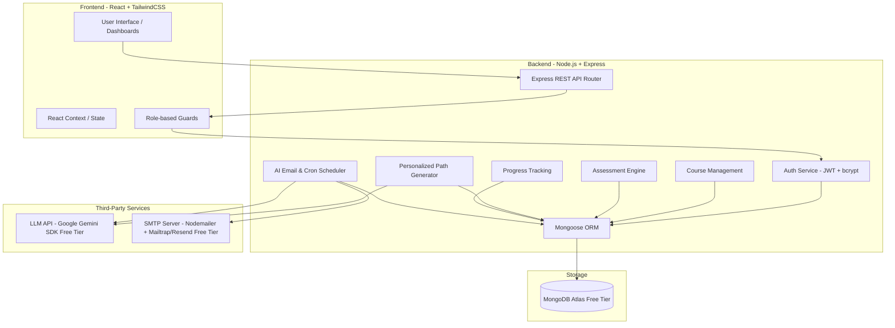

# Implementation Plan: Personalized Learning Path Generator for Course Platforms

This document outlines the finalized technical implementation plan for a production-grade B2B SaaS platform that generates personalized learning paths for online courses using the **MERN (MongoDB, Express, React, Node.js)** stack and LLM integration.

---

## 1. System Architecture



---

## 2. Finalized Zero-Cost Architectural & Service Decisions

Based on your requirement for a **100% free tier / no cost** setup for development, the following decisions are locked in:

### A. LLM Provider: Google Gemini API (`gemini-1.5-flash`)
* **Selection**: We will use the Google Gemini API (specifically the `gemini-1.5-flash` model).
* **Why Not OpenAI or Anthropic**:
  - Neither OpenAI nor Anthropic offers a permanent free developer API. Both require you to set up billing (adding a credit card) and pre-fund your account (minimum $5) before keys will work.
  - **Google Gemini Free Tier**: Google AI Studio provides a free tier for Gemini 1.5 Flash (15 RPM / 1 million TPM) which is completely free to use without requiring any billing configurations or credit cards.
* **How to Obtain API Keys**:
  1. Go to [Google AI Studio](https://aistudio.google.com/).
  2. Log in with your standard Google account.
  3. Click **Get API key** in the sidebar.
  4. Create a new key and add it to your `.env` file as `GEMINI_API_KEY`.

### B. Email Infrastructure: Nodemailer & SMTP Setup
* **Nodemailer Usage**: Yes, Nodemailer is a free open-source Node.js library used to compile and send emails.
* **SMTP Provider Choice (No-Cost Option)**:
  - **Development/Testing**: **Mailtrap Free Sandbox**. This lets you test the email sending loop without any limits or charges, and catches all sent emails in a private virtual inbox.
  - **Production/Real Sending**: **Resend Free Tier** (allows sending 3,000 free emails per month without requiring a credit card) or standard **Gmail SMTP** (using a free Gmail account with a generated App Password).

### C. Database & Deployment (No-Cost Option)
* **Database**: **MongoDB Atlas Free Shared Tier (M0)**. Offers 512MB of storage which is more than enough for testing and staging.
* **Hosting**: We will deploy the backend to **Render (Free Tier)** and the frontend to **Vercel (Free Tier)**.

### D. Repository Structure & Styling (Monorepo + Tailwind CSS)
We will structure the project as a **monorepo** consisting of `/client` (Vite + React + Tailwind CSS) and `/server` (Node.js + Express) subfolders in a single repository.
* **Styling Choice**: We will use **Tailwind CSS** as requested in the system specification.
* **Monorepo Pros**:
  - Simplified dependency orchestration: Developers can run both client and server with a single command.
  - Unified project management and version control.

---

## 3. Database Schemas (Mongoose)

### 1. `User` Model
```javascript
{
  name: { type: String, required: true },
  email: { type: String, required: true, unique: true },
  password: { type: String, required: true },
  role: { type: String, enum: ['Admin', 'Learner'], default: 'Learner' },
  refreshToken: { type: String },
  lastActive: { type: Date, default: Date.now }
}
```
> [!NOTE]
> **Why 'Learner' is the default role**:
> The vast majority of accounts created via the public signup flow will be student learners. By keeping `Learner` as the default, we prevent accidental escalation of privilege. New administrative accounts (`Admin`) must be explicitly seeded, modified by database commands, or designated by existing admins.

### 2. `Course` Model
```javascript
{
  title: { type: String, required: true },
  description: { type: String },
  modules: [{
    title: { type: String, required: true },
    description: { type: String },
    contentUrl: { type: String },
    contentText: { type: String },
    duration: { type: Number }, // in minutes
    difficulty: { type: String, enum: ['Beginner', 'Intermediate', 'Advanced'] }
  }],
  assessment: [{
    question: { type: String, required: true },
    options: [{ type: String, required: true }],
    correctAnswer: { type: String, required: true },
    skillTag: { type: String, required: true } // e.g. "Arrays", "Binary Trees"
  }]
}
```

### 3. `LearnerCourse` Model
```javascript
{
  learner: { type: Schema.Types.ObjectId, ref: 'User', required: true },
  course: { type: Schema.Types.ObjectId, ref: 'Course', required: true },
  assessmentResults: [{
    questionId: { type: String },
    skillTag: { type: String },
    isCorrect: { type: Boolean }
  }],
  skillScores: { type: Map, of: Number }, // e.g. { "Arrays": 80, "Trees": 20 }
  personalizedPath: [{
    moduleId: { type: Schema.Types.ObjectId },
    sequenceOrder: { type: Number },
    shouldSkip: { type: Boolean, default: false },
    reason: { type: String }
  }],
  pathGeneratedAt: { type: Date },
  pathGenerationTimeMs: { type: Number }, 
  status: { type: String, enum: ['Onboarding', 'Active', 'Completed'], default: 'Onboarding' }
}
```

### 4. `Progress` Model
```javascript
{
  learner: { type: Schema.Types.ObjectId, ref: 'User', required: true },
  course: { type: Schema.Types.ObjectId, ref: 'Course', required: true },
  moduleId: { type: Schema.Types.ObjectId, required: true },
  completedAt: { type: Date, default: Date.now }
}
```

### 5. `EmailLog` Model
```javascript
{
  learner: { type: Schema.Types.ObjectId, ref: 'User', required: true },
  emailType: { type: String, enum: ['Welcome', 'WeeklyDigest'] },
  sentAt: { type: Date, default: Date.now },
  status: { type: String, enum: ['Success', 'Failed'] },
  errorMessage: { type: String },
  emailContent: { type: String }
}
```

---

## 4. Step-by-Step Build Plan

### Phase 1: Foundation (Days 1–7)
- **Monorepo Setup**: Establish `/client` (React + Vite + Tailwind CSS) and `/server` (Node.js + Express).
- **Database Connection**: Configure MongoDB client with Mongoose schemas.
- **Auth Service**:
  - JWT creation & storage.
  - Refresh token rotation logic.
  - Role-based middleware (`verifyAdmin`, `verifyLearner`).
- **CRUD APIs**:
  - Admin Course creation & editing.
  - Admin Assessment definition.
- **Frontend Pages**:
  - Login & Registration.
  - Admin dashboard base layouts.

### Phase 2: Core Engine (Days 8–14)
- **Onboarding Assessment**:
  - API to receive student's choices, grade them, and compute skill tags.
- **LLM Engine**:
  - Structure prompt for Gemini containing Course Syllabus and Learner Skill Profile.
  - Parse structured response: ordered modules, skips, and reasons.
- **Custom Path Rendering**:
  - Save path in DB.
  - Render learner dashboard following custom sequence (skipping marked modules).
- **Progress Tracking**:
  - Endpoint to complete modules.
  - Real-time/SSE or polling progress bars on the frontend.

### Phase 3: AI Email & Admin Analytics (Days 15–21)
- **Welcome Email**:
  - LLM generates a personalized "Day 1 Welcome" email summarizing skill gaps and focus areas. Sent via Nodemailer.
- **Weekly Digest**:
  - `node-cron` scheduled to run weekly.
  - Aggregates learner progress, queries LLM for a personalized encouraging update, and sends email.
- **Admin Analytics Dashboard**:
  - Course completion rate, drop-off heatmaps.
  - Learner Health Score calculation: `(Completion % * 0.5) + (Login Recency Score * 0.3) + (Avg Module Score * 0.2)`.

### Phase 4: Polish, Security & Deployment (Days 22–28)
- **Security & Error Handling**:
  - API rate limiting, Joi validations, LLM token cost control.
  - Graceful fallback: If LLM fails, generate path using default course sequence.
- **Deployment**:
  - Backend deployment to Render/Railway.
  - Frontend deployment to Vercel.

---

## 5. Measurable Outcomes (Metrics) & Computation Strategy

| Metric | Business Value | Computation Strategy / Rationale |
| :--- | :--- | :--- |
| **Course Completion Rate** | Tracks effectiveness of personalization | Count active learners who completed all non-skipped modules in their `personalizedPath` / Total active learners. |
| **Drop-off Module** | Identifies problematic course sections | Find modules that are the last-completed module for learners who have been inactive for > 7 days. |
| **Avg Time to Path Gen** | Ensures fast onboarding user experience | Average of `pathGenerationTimeMs` from `LearnerCourse` records. **Goal: < 3000ms**. *(Derived from industry web page load standards; 3 seconds is the user abandonment threshold)* |
| **Email Delivery Rate** | Tracks health of the communication system | `Success` logs vs total logs in `EmailLog` collection. |
| **Learner Health Score** | Flags at-risk learners before they churn | Aggregate and visualize the distribution of health scores across Green, Yellow, and Red zones. |
| **Path Personalization Variance** | Proves paths are truly custom per learner | **Levenshtein Distance** & **Jaccard Distance**: Standard deviation of Jaccard similarity distance of module lists/skips, and Levenshtein distance on module order lists across all generated paths. |

> [!NOTE]
> **Why Levenshtein Distance & Jaccard Distance?**
> * **Jaccard Distance** measures the difference in *which* modules are included vs. skipped.
> * **Proximity / Levenshtein Distance** calculates the variation in the *sequence order* of the modules.
> Together, these metrics verify that the LLM is genuinely custom-ordering paths based on skills, rather than distributing uniform paths.

---

## 6. Alignment with Spec and MVP Features

This plan fully conforms to the **LMS_SPEC.pdf** specifications:
1. **Core Modules**: Implements all 7 required core modules.
2. **Tech Stack**: Follows the MERN option precisely (React + Node.js + Express + MongoDB).
3. **Analytics**: Computes the exact metrics described in Section 6, including Learner Health Scores and Path Personalization Variance.
4. **Features**: Fully targets the Core MVP list in Section 4.

---

## 7. Verification Plan

### Automated Tests
- Integration tests for JWT Authentication and Route Guards.
- Validation checks for LLM input/output parsers (using mock LLM responses).
- Database seeding script with fake courses, learners, progress, and mock metrics generator.

### Manual Verification
- Testing the onboarding flow end-to-end to verify the personalized path renders differently for different skill scores.
- Testing email delivery logs locally using Mailtrap.
- Verifying the Admin dashboard displays charts correctly.
